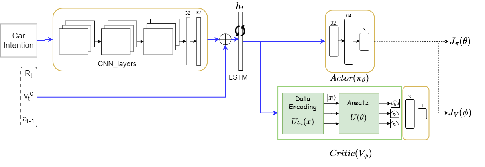
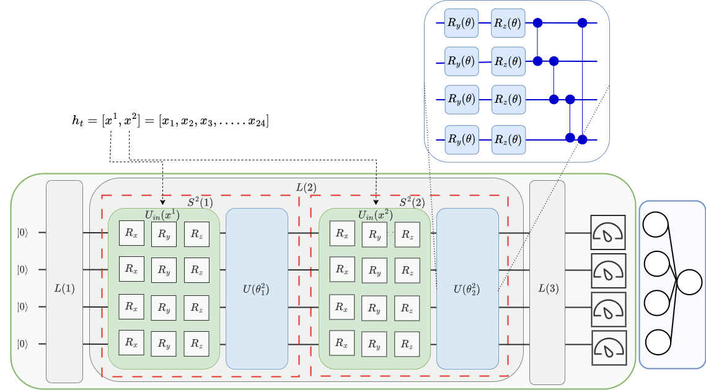

# Nav-Q: Quantum Deep Reinforcement Learning for Collision-Free Navigation of Self-Driving Cars

This repository includes the implementation for Nav-Q [[Sinha et al., 2023]][Nav-Q]

### Overview
Nav-Q, the first quantum-supported DRL algorithm for CFN of self-driving cars, that leverages quantum computation for improving the training performance without the requirement for onboard quantum hardware. Nav-Q is based on the actor-critic approach, where the critic is implemented using a hybrid quantum-classical algorithm suitable for near-term quantum devices. The following figure shows the architecture of Nav-Q. 

The critic in Nav-Q is realized through a hybrid quantum-classical algorithm made up of two components as shown in the figure below. 

The first one is a PQC implemneted using QIDEP (Qubit Independent Data Encoding and Processing) which processes the hidden state of the LSTM through unitary operations to generate a parametrized quantum embedding in the Hilbert space. The quantum embedding is then converted into an n- dimensional classical vector (where n is the number of qubits of the quantum circuit) using the expectation measurement of Pauli-Z observables for each single qubit. At this point, there is a mismatch between the output of PQC and the required dimension of the Value function. Thus, to map the n-dim vector resulting from the PQC to a single value, the second part of the critic is implemented, which is essentially a fully connected (FC) neural network layer made up of n input and one output nodes (no hidden layers).

### Environment Setup
1. Install CARLA by following the instructions mentioned here([https://carla.readthedocs.io/en/latest/start_quickstart/#carla-installation][CARLA Installation]). 
This repository is compatible with CARLA 0.9.13
2. Create a python virtual environment and install all the required dependencies using the command `pip install -r requirements.txt`
3. Set CARLA-CTS02 as the working directory.

### Steps to Run

**Debug Mode**
This mode should be used for development environments. 
1. In this mode, CARLA server is started independently as a separate
process using the Carla-CTS02/utils/test_carla_server.py file. Make sure, that the path of the CARLA executable is updated.
2. Start training Nav-Q model using the following command:

    `python train_a2c.py --a2c --port 2000 --debug --latent_space_dim 32 --seed 54 --quantum --n_qubits 4 --n_layers 1` 
    Note that this command is used to train Nav-Q with 4 qubits and 1 layer.
3. Train NavA2C using the following command:

    `python train_a2c.py --a2c --port 2000 --debug --latent_space_dim 32 --seed 54`
4. Evaluate Nav-Q/NavA2C using the following command: 

    `python eval_a2c.py --a2c --port 2000 --debug --latent_space_dim 32 --checkpoint <path of the model> --deter `
Note that deter flag is used to set that the model determines actions deterministically at test time. 

### Notes
1. If the repo has to be executed on a cluster, then CARLA server has to be started at the time of training from within the program. In such a case, do not use 'debug' flag while running
the training and evaluation. 
2. Make sure to update the path of CARLA executable in "run_server" method in Carla-CTS02/utils/utils.py  

### Citation
If you find Nav-Q useful in your research, please consider citing our paper:

`
@misc{sinha2023navq, 
      title={Nav-Q: Quantum Deep Reinforcement Learning for Collision-Free Navigation of Self-Driving Cars}, 
      author={Akash Sinha and Antonio Macaluso and Matthias Klusch},
      year={2023},
      eprint={2311.12875},
      archivePrefix={arXiv},
      primaryClass={quant-ph}
}
`

### Contact
For any inquiries, please reach out to:

1. Akash Sinha: akashshubham95@gmail.com
2. Antonio Macaluso: antonio.macaluso@dfki.de

[CARLA Installation]: https://carla.readthedocs.io/en/latest/start_quickstart/#carla-installation

[Nav-Q]: https://arxiv.org/abs/2311.12875
